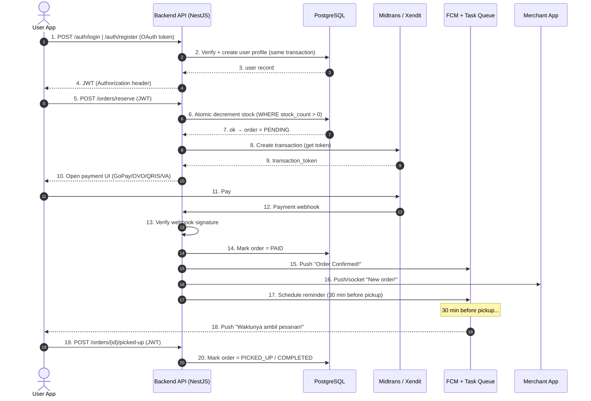
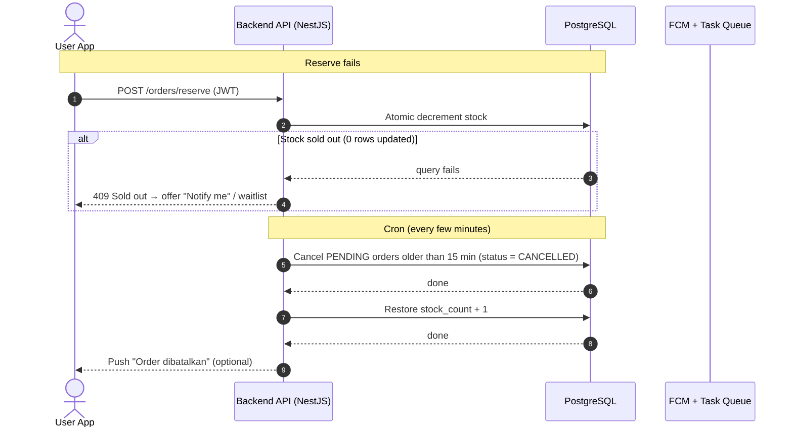

# Part 3 – Sequence Diagram (for Miro)

Rendering: paste each block into https://mermaid.live (or the Mermaid app on Miro) and rebuild as swimlanes on the board.

Split into **2 diagrams** for readability:
- Diagram A → happy path (auth → order → payment → notif).
- Diagram B → edge cases (sold out + cron timeout).

## How to read the diagram

**Legend:**
- **Box at the top (swimlane)** = the system/actor involved: `User App`, `Backend API`, `PostgreSQL`, `Midtrans/Xendit`, `FCM + Task Queue`, `Merchant App`. The dashed line running down = each system's "lifeline".
- **Solid arrow (→)** = request/action from one system to another (e.g. `User App → Backend API` = the user sends a request).
- **Dashed arrow (-->>)** = response/reply.
- **Self-loop arrow (A → A)** = internal process within a single system (no other system involved).
- **`Note`** = timing/condition annotation, not a message between systems.
- **`alt ... end`** = conditional branch (only one path runs).
- **Numbers (1, 2, 3, ...)** = execution order, top to bottom.

**How to read it:** start at number 1 and follow the arrows left to right. Each arrow = one interaction. If an arrow points back (left), it's the reply to the previous step. Sequential numbers mean time order, so read it like a story.

---

## Diagram A — Happy Path

**Diagram A story:**
1. User logs in/registers → Backend verifies and creates the user profile, then returns a JWT.
2. User clicks "Reserve" → Backend checks stock atomically (if sold out, continue to Diagram B).
3. Backend requests a payment token from Midtrans, then opens the payment UI in the user app.
4. User pays → Midtrans sends a webhook → Backend verifies the signature → order becomes `PAID`.
5. Backend sends notifications: "Order Confirmed!" to the user, "New order!" to the merchant, and schedules the pickup reminder.
6. When the reminder fires, the user receives the "Waktunya ambil pesanan!" push.
7. User picks up the order → order becomes `PICKED_UP/COMPLETED`.

## Diagram B — Edge Cases (sold out & timeout)

**Diagram B story:**
1. **Sold out scenario:** during reserve, the stock query fails (0 rows updated) → Backend replies `409 Sold out` and offers the user a "Notify me"/waitlist option.
2. **Timeout scenario (cron):** every few minutes, the cron finds `PENDING` orders older than 15 minutes → cancels them (`CANCELLED`) → restores the stock (`stock_count + 1`) → optionally pushes "Order dibatalkan" to the user.

## Notes to keep in sync with the document
- Order status follows the state machine: `PENDING → PAID → PICKED_UP/COMPLETED`, plus `CANCELLED`.
- SQL details (`UPDATE surprise_bags ...`, `WHERE created_at < now() - 15 min`) are not written in the diagram — they live in `Part_3_System_Design.md`.
- Labels can be switched to Bahasa Indonesia if you want to match the current Miro board style.
