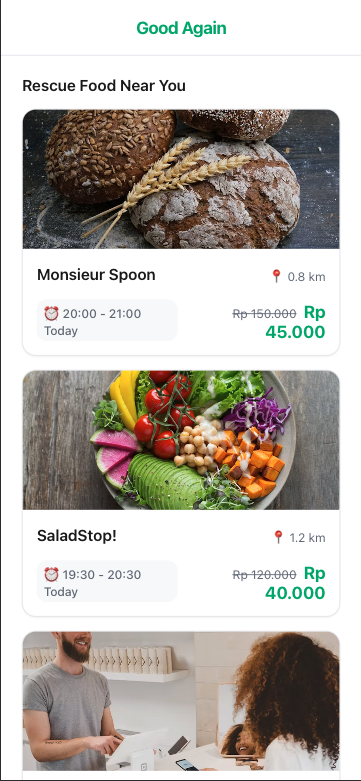
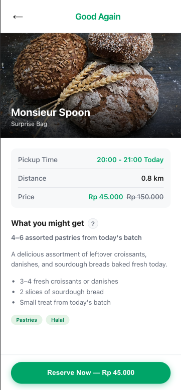
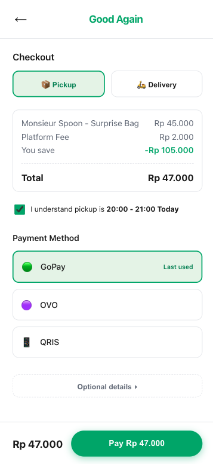
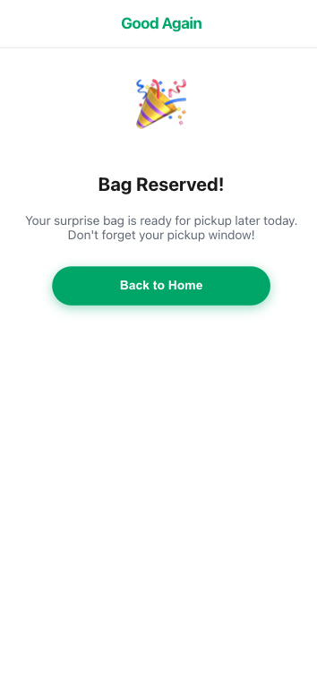

# Good Again - Full-Stack Product Engineer Final Challenge

Hi team! Thank you for the opportunity to work on this challenge. I had a lot of fun thinking through the problem and building this out. 

Here is a quick breakdown of my submission:

## Live Demo
**👉 [Check out the live app here](https://customer-surprise-bag-flow.vercel.app)**

## 1. `src/` (Source Code)
This folder contains the React/Vite application for the Customer Surprise Bag flow.

**App Screenshots:**
<div style="display: flex; gap: 10px; overflow-x: auto;">
  
  
  
  
</div>

- **Tech Stack:** React, Vite, standard CSS.
- **My approach:** I decided to build the Customer Surprise Bag flow because I felt it was the most critical part of the user journey. I went with standard CSS instead of Tailwind just to keep the dependencies light and show my grasp of fundamental styling. I made it mobile-first since that's how most users will interact with a food pickup app.

**To run it locally:**
```bash
npm install
npm run dev
```

## 2. [Part 2: Product & UX Review](./Part_2_Product_UX_Review.md)
I reviewed the Lovable MVP and jotted down my top 10 UX feedback points. I focused heavily on things that would directly impact conversion rates (like missing distance context and dietary filters).

## 3. [Part 3: System Design](./Part_3_System_Design.md)
I sketched out a high-level architecture for the backend. I tried to balance what makes sense for a fast-moving early-stage startup (Firebase/Supabase) with what is strictly necessary for e-commerce (PostgreSQL for inventory locking).

Thanks again for the challenge, and I'd love to chat more about these decisions!
